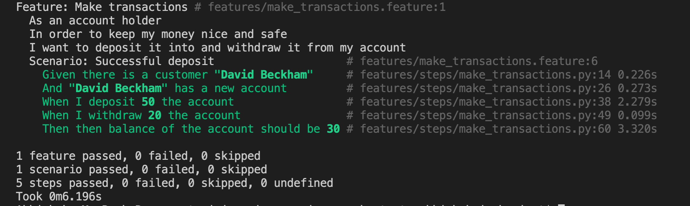

# GCP Training Microservice Service Smoke Test

The purpose of this project is to aggregate all the services and run a smoke test.

## Execute Smoke Test Locally.

Assuming that all the Microservices are deployed successfully.

Before running smoke test you should set below environment variables with respective Endpoints exposed by the Cloud Run Services.

Note: If you have used the ```setup_gcp_infra.sh``` script to deploy the Microservices the respective endpoints should be available in ```microservice_url_env.sh``` file.
```
export CUSTOMER_SERVICE_URL=https://GCP_TRAINING_CUSTOMER_SERVICE_URL
export ACCOUNT_SERVICE_URL=https://GCP-TRAINING-ACCOUNT-SERVICE-URL
export CASHIER_SERVICE_URL=https://GCP_TRAINING_CASHIER_SERVICE_URL
export TRANSACTION_SERVICE_URL=https://GCP_TRAINING_TRANSACTION_URL
export BALANCE_SERVICE_URL=https://GCP_TRAINING_BALANCE_SERVICE_URL
```

Validate that the environment variables are set correctly by executing below command:
```bash
echo $CUSTOMER_SERVICE_URL
```
or to see all the environment variables execute below:
```bash
env
```
Remember if you close the terminal all the temporary environment variables will be removed and you need to re export them again.

Execute below command to run smoke test.
```bash
    make tests
```
Once executed you should see the smoke test as below:


## Execute Smoke Test in Cloud Build.

As you have already exported the respective Microservice URLs in the environment variables hence just execute below command to trigger the cloud build smoke tests in pipeline.

```bash
gcloud builds submit --substitutions=_CUSTOMER_SERVICE_URL=$CUSTOMER_SERVICE_URL,_ACCOUNT_SERVICE_URL=$ACCOUNT_SERVICE_URL,_CASHIER_SERVICE_URL=$CASHIER_SERVICE_URL,_TRANSACTION_SERVICE_URL=$TRANSACTION_SERVICE_URL,_BALANCE_SERVICE_URL=$BALANCE_SERVICE_URL
```